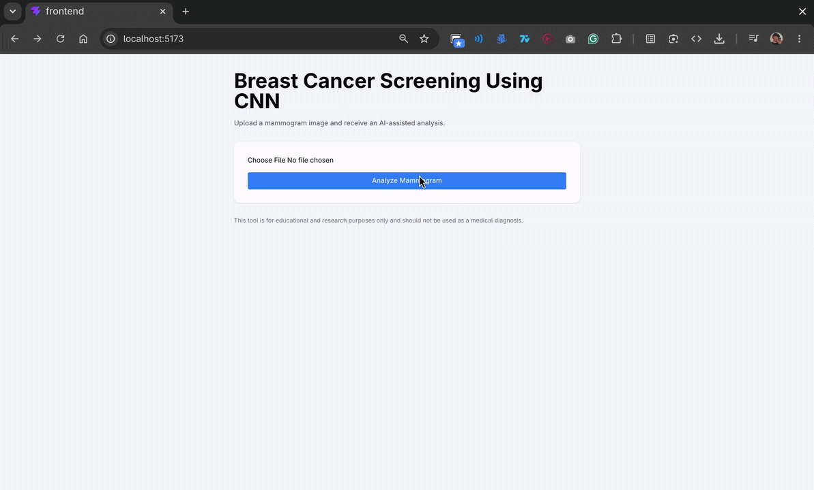

# Breast-Cancer-Diagnostic-Website
<p align="center">
An Intelligent Mammogram Screening System for Early Breast Cancer Detection Using Convolutional Neural Networks.
</p>

## Introduction

This project is a web-based breast cancer diagnostic tool that uses a convolutional neural network to assist in the early detection of breast cancer from mammogram images. Its scope is to provide a simple end-to-end prototype that demonstrates image-based medical classification, from dataset preparation and local model training to backend prediction serving and a user-friendly web interface.

- Built with React for a clean and responsive user interface for uploading images and viewing results.
- Powered by FastAPI on the backend to serve predictions quickly and efficiently.
- Trained a convolutional neural network model locally using a breast cancer image dataset for classification.


## Demo


## Project Structure

- `backend/`
  - `app/`
    - `main.py` - FastAPI application entry point.
    - `routes/predict.py` - Prediction API endpoints.
    - `services/predictor.py` - Model loading and prediction logic.
  - `requirements.txt` - Python backend dependencies.
  - `uploads/` - Uploaded mammogram images storage.
- `frontend/`
  - `src/` - React application source code.
  - `public/` - Static assets.
  - `package.json` - Frontend dependencies and scripts.
- `ml/`
  - `train.py` - Training script for the CNN model.
  - `predict.py` - Local prediction utilities.
  - `config.py` - Training and dataset configuration.
  - `dataset/` - Dataset preparation and image organization.
- `models/`
  - `breast_cancer_model.keras` - Saved trained model.
- `README.md` - Project documentation.

## Quick Start

Follow these steps to set up the project locally.

### 1. Clone the repository:

```bash
git clone https://github.com/ArjKre/Breast-Cancer-Diagnostic-Website.git
cd Breast-Cancer-Diagnostic
```

### 2. Set up the Python backend:

```bash
cd backend
python3.12 -m venv .venv
source .venv/bin/activate
pip install -r requirements.txt
```

> If you want to download the dataset and train the model yourself, first download the dataset ZIP from the Kaggle link below. **Unzip** the dataset into `ml/dataset`, then run:
>
> ```bash
> python ../ml/dataset/prepare_dataset.py
> ```
>
> This prepares the local dataset before training or running the model.
>
> **Kaggle Dataset:** https://www.kaggle.com/datasets/awsaf49/cbis-ddsm-breast-cancer-image-dataset

### 3. Start the FastAPI backend:

```bash
uvicorn app.main:app --reload
```

### 4. Install and run the React frontend:

```bash
cd ../frontend
npm install
npm run dev
```

### 5. Open the app in your browser:

- **Frontend:** `http://localhost:5173`
- **Backend API:** `http://localhost:8000`

The frontend is configured to send requests to the backend at `http://localhost:8000`.


## Internship Information

* **Intern ID:** CITS6417
* **Intern Name:** Arjun Kreshnan C M
* **Organization:** CODTECH IT Solutions Private Limited
* **Domain:** Machine Learning
* **Internship Duration:** 6 Weeks
* **Internship Period:** 22 June 2026 – 03 August 2026